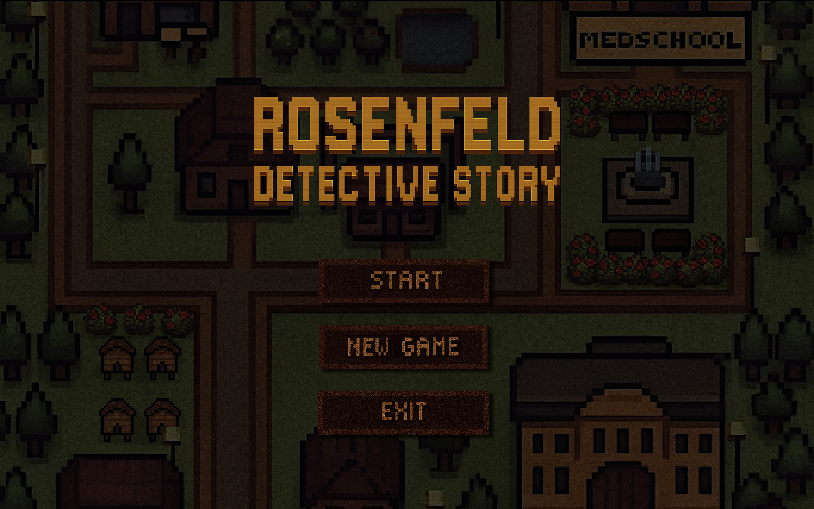
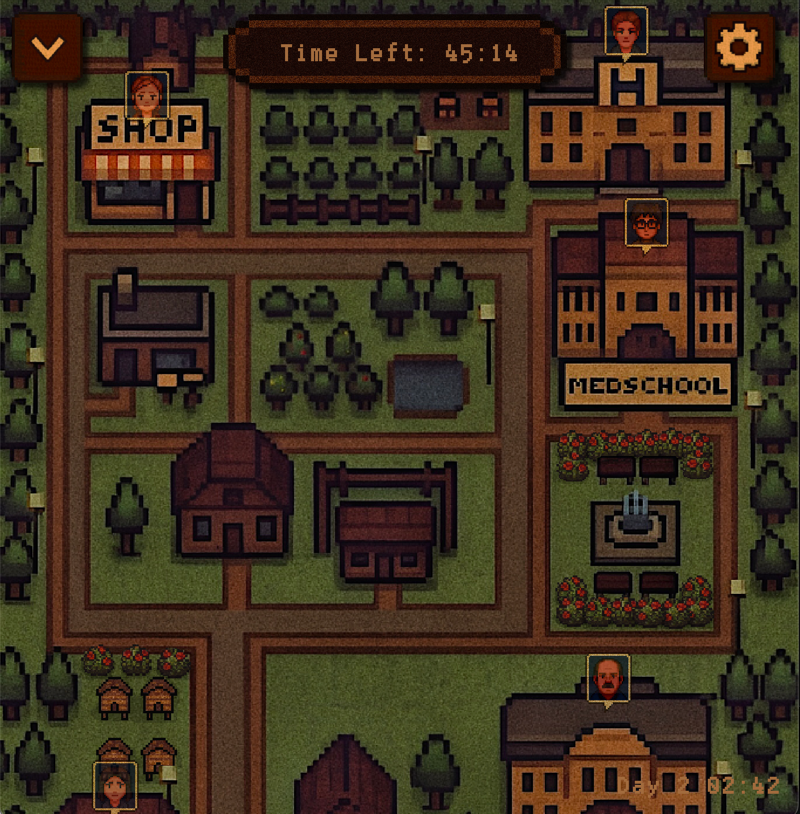
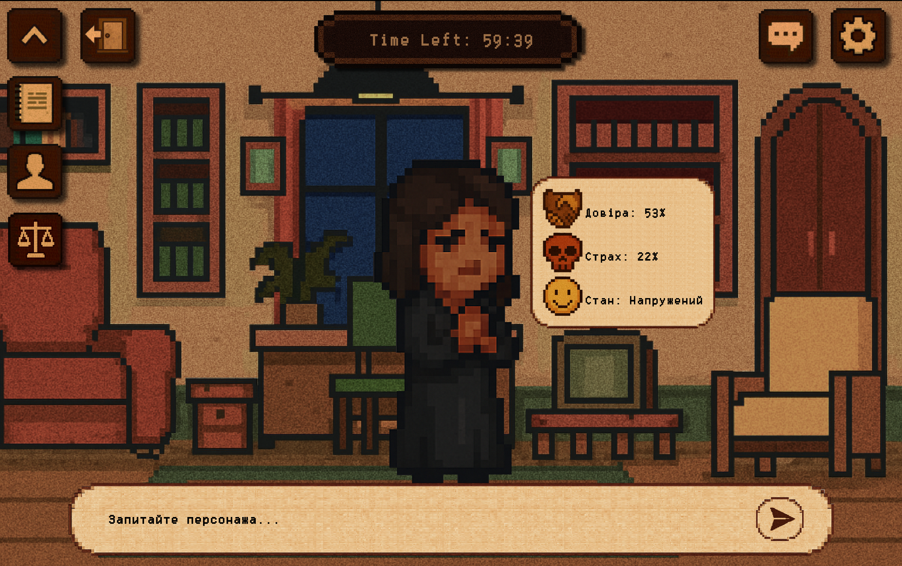
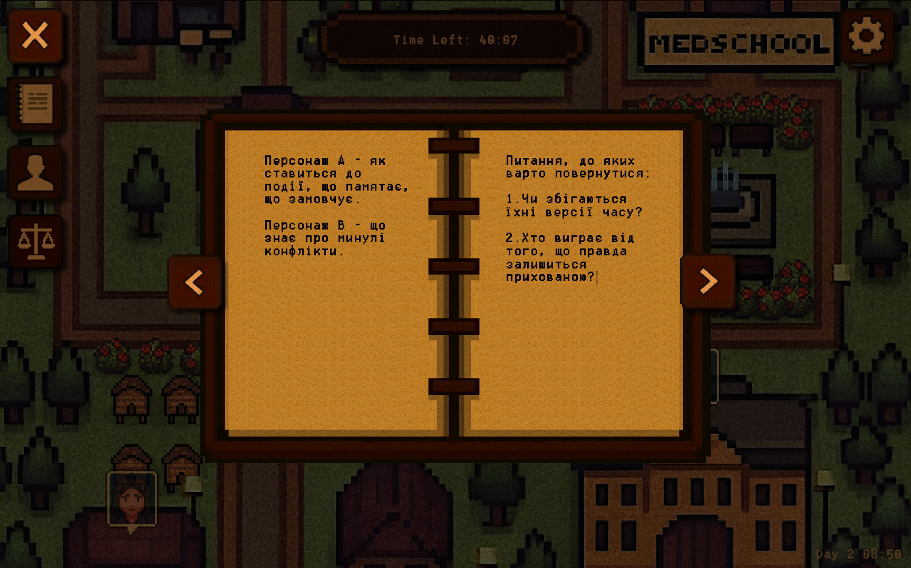

# ROSENFELD: DETECTIVE STORY

Невелика детективна гра про місто, яке не хоче визнавати, що сталося вбивство.

---

## 1. Про що ця гра

**Місце дії:** тихе європейське містечко Розенфельд.  
**Жанр:** моральний детектив / розслідування через діалоги.

В центрі сюжету — смерть **доктора Адріана Вальтера**, якого знаходять вночі в кабінеті старого крила лікарні.  
Офіційно всі говорять про “нещасний випадок” або “вигорання”, але щось у цьому не сходиться.

Ви граєте за детектива, який:

- розпитує жителів міста;
- збирає факти в досьє;
- намагається зрозуміти, хто бреше, а хто просто боїться правди.

---

## 2. Основна мета

- Зʼясувати, що насправді сталося з доктором Вальтером.
- Зібрати якомога більше **секретних фактів** про ключових персонажів.
- Прийняти **моральне рішення** в фіналі, спираючись на все, що ви дізналися.

> Гра не про “знайти правильний варіант для звинувачення”, а про те, як ви ставите запитання і що вирішуєте в кінці.

---

## 3. Управління

### 3.1. Клавіатура

Клавіатура використовується для навігації по карті та надсилання питання.

| Дія                             | Клавіша                         |
|---------------------------------|---------------------------------|
| Рух по карті                    | Стрілки `↑` `↓` `←` `→`         |
| Надіслати питання персонажу     | `Enter`                         |

### 3.2. Миша

Усі кліки й взаємодії з інтерфейсом виконуються мишкою.

| Дія                                               | Кнопка / жест                                   |
|--------------------------------------------------|-------------------------------------------------|
| Переміщення по карті                             | Затиснути **ЛКМ** на карті й перетягувати       |
| Прокрутка історії розмови перетягуванням         | Затиснути **ЛКМ** на історії та тягнути вгору / вниз |
| Прокрутка історії розмови колесиком              | Колесико миші (скрол вгору / вниз)              |
| Натискання кнопок інтерфейсу, вибір елементів    | Одинарний клік **ЛКМ**                          |

---

## 4. Інтерфейс

### 4.1. Екран карти міста

На головному екрані ви бачите карту Розенфельду.

Основні елементи:

1. **Іконки персонажів на карті**
    - Кожен NPC позначений іконкою.
    - **Клік по іконці** відкриває **екран діалогу** з цим персонажем.

2. **Меню / панель дій**  
    Розташована в лівому верхньому кутку екрана, містить:
    - кнопку **нотаток** — відкриває нотатки для запису необхідної інформації;
    - кнопку **досьє** — відкриває список персонажів і зібрані факти;
    - кнопку **“Звинувачення”** — переходить до фінального вибору, коли вона доступна (див. розділ 6.2);

3. **Налаштування та пауза**
    Розташовані в правому верхньому кутку екрана.
    - При відкритті **меню налаштувань** гра ставиться на **паузу**:
        - час не рухається;
        - таймер проходження зупиняється до закриття меню.

4. **Зворотний відлік часу**
   - Зверху по центру відображається **таймер**, який показує скільки часу **залишилося** до кінця відведеної години.

### 4.2. Екран діалогу з персонажем

Коли ви клікаєте по іконці NPC на карті, відкривається екран розмови.

Основні елементи:

1. **Сам персонаж**

2. **Діалогове вікно**
    - Область, де зʼявляються поточні репліки персонажа.

3. **Історія діалогу**
    Розташована в правому верхньому кутку екрана, поряд з налаштуваннями.
    - Список попередніх реплік (ваших і NPC);
    - Можна прокручувати:
        - перетягуванням (ЛКМ і тягнути вгору / вниз);
        - колесиком миші.

4. **Поле вводу питання**
    - Текстове поле, в яке ви вводите своє запитання;
    - Надсилання питання — клавішею `Enter` або відповідною кнопкою.

5. **Статистика / стани NPC**
    - Поруч з NPC розташований невеликий блок зі станом персонажа:
        - **довіра** (наскільки персонаж схильний говорити правду);
        - **страх** (наскільки йому небезпечно говорити правду).
        - **стан**
    - Ці значення **можуть змінюватися** в залежності від вашого стилю запитань.

6. **Зворотний відлік часу**
    - Таймер гри видимий і тут, щоб ви бачили, скільки часу лишилося до фінального вибору.

---

## 5. Діалоги та NPC

У грі немає фіксованого дерева діалогів — ви **самостійно вводите текст запитання**, а NPC відповідають живою мовою.

За лаштунками:

- Кожен NPC має **рівень довіри** та **рівень страху** (`0.0 – 1.0`).
- Якщо **довіра висока**, персонаж говорить більш відверто.
- Якщо **страх високий**, він може:
    - брехати;
    - ухилятися від прямої відповіді;
    - переводити тему.

Якщо ви довго та часто ставите запитання одному NPC, його стан з часом змінюється:
- довіра може зменшуватися;
- страх — зростати.

> Ввічливі формулювання підвищують довіру. Грубі слова, звинувачення і тиск — підживлюють страх і закривають частину відповідей.

### 5.1. Як ставити “гарні” запитання

Найкраще працюють запитання:

- короткі й конкретні;
- без кількох тем в одному реченні;
- з нормальним тоном: без грубих образ і прямих звинувачень (особливо на початку).

**Приклади:**

- `Де ти був тієї ночі, коли помер доктор Вальтер?`
- `Які в тебе були стосунки з доктором Вальтером?`
- `Чому ти нервуєш, коли говориш про лікарню?`

---

## 6. Досьє, факти і секрети

У грі є система **досьє**:

- Кожен персонаж має сторінку з:
    - імʼям, віком, роллю;
    - відомими публічними фактами;
    - **прихованими фактами** (секретами), які відкриваються лише після серії конкретних питань.

### 6.1. Як відкривати приховані факти

- Ставте питання про **конфлікти, минулі події, стосунки з доктором Вальтером**.
- Якщо NPC **прямо озвучує ключову ідею** факту, гра вважає цей факт “розкритим” і додає його в досьє.

### 6.2. Ліміт часу та фінальне звинувачення

На проходження гри у вас є **1 година реального часу**.

Кнопка **“Accuse”** працює за такою логікою:

- Спочатку вона **недоступна**.
- Вона стає доступною, якщо:
    - ви відкрили щонайменше **10 із 15 ключових фактів**, **або**
    - **вичерпано час** (минуло 60 хвилин гри).

#### Коли час закінчується

Після завершення години зʼявляється повідомлення:

> **“Час закінчився. Перейти до звинувачення?”**

- Якщо ви обираєте **“Так”**:
    1. Ви обираєте персонажа, якого хочете звинуватити.
    2. На основі:
        - ваших діалогів із цим персонажем;
        - відкритих фактів у досьє  
          гра формує епілог.

    - Якщо ви **правильно визначили вбивцю** і зібрали достатньо фактів —  
      у фіналі розкривається його **справжній мотив**.
    - Якщо **фактів недостатньо** або ви **звинувачуєте не ту людину** —  
      гра **не називає справжнього вбивцю** і формує епілог, базуючись лише на доступній інформації.

- Якщо ви обираєте **“Ні”** (взагалі уникаєте звинувачення):
    - Гра формує епілог про **наслідки незробленого вибору** — що сталося з містом і справою, коли детектив так і не наважився вказати на винного.

---

## 7. Сесії, збереження та прогрес

Гра автоматично зберігає:

- рівень довіри / страху NPC;
- відкриті приховані факти;
- нотатки;
- ключову інформацію про ваш прогрес у розслідуванні.

Збереження відбувається:

- після важливих діалогів;
- при виході в головне меню.

---

## 8. Поради для першого проходження

1. **Не поспішайте зі звинуваченням.** Коли натиснете цю кнопку — шляху назад уже не буде.
2. **Повертайтесь до NPC.** Нові факти можуть змінювати їхні відповіді.
3. **Читайте досьє.** Там накопичуються підказки, які легко забути з діалогів.
4. **Робіть нотатки.** Записуйте алібі персонажів та час подій, суперечливі репліки, можливі мотиви та звʼязки 
між героями та власні гіпотези щодо вбивства.

5. **Стежте за часом.** Навіть якщо ви не готові звинувачувати, година все одно закінчиться.
6. **Експериментуйте з формулюваннями.** Інше запитання або інший тон можуть “розблокувати” нові факти.

---

## 9. Інтернет та робота діалогів

Гра використовує онлайн-моделі мовлення, щоб NPC відповідали “живим” текстом.

- Основна модель: **OpenAI** (`gpt-5-mini`)
- Резервна модель (фолбек): **Groq** (`gpt-oss-120b`)

Якщо:

- немає інтернету; **або**
- обидва сервіси повертають помилку —

NPC тимчасово не можуть відповідати, поки звʼязок не відновиться.

> Якщо діалоги раптом перестали працювати — спершу перевірте інтернет-підключення.

---

## 10. Відомі проблеми / обмеження

- Іноді NPC можуть відповідати трохи **не по темі** — спробуйте переформулювати запитання.
- Модель може вигадувати деталі, які **не існують у каноні**. Гра намагається обмежувати це через внутрішні правила, але таке все ще можливо.
- На слабкому інтернеті відповіді можуть приходити із відчутною затримкою.

---
